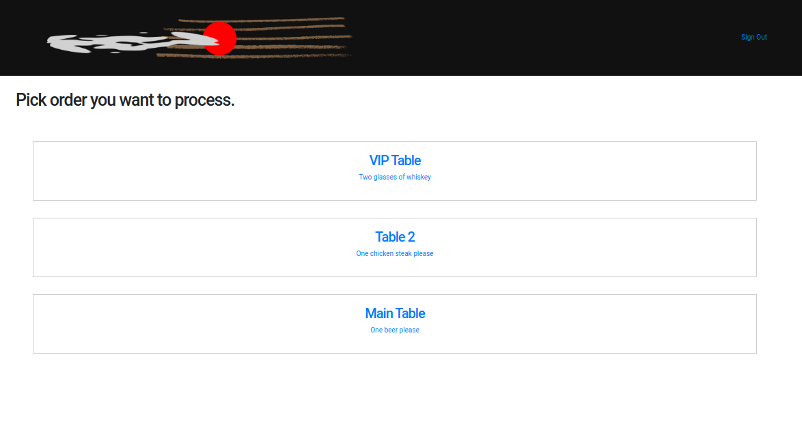
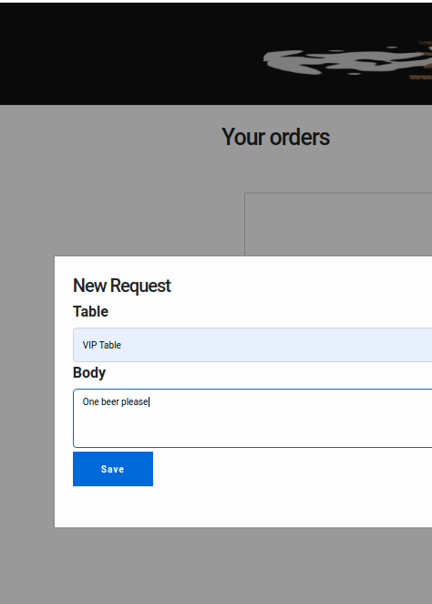

# Waiter

*This project is experimental and is not actively maintained.

Real-time socket based web application 
intended for restaurants to be used as **real-time** order management system.
Any new order from any customer is instantly visible on a waiter screen to be processed.

Project is based on Elixir Phoenix framework, and their interesting **Live View** feature.

https://www.phoenixframework.org

### Setup
To set up locally please follow instructions from https://hexdocs.pm/phoenix/installation.html#content
to install all the dependencies. (`Errlang VM`, `Elixir`, `Phoenix framework`, `PostgreSQL` and `NodeJS`)

#### Next steps after installation

`mix ecto.create` To create and configure your database

`mix ecto.migrate` To create DB tables

`mix phx.server` To run the server

### Waiter page

### Order page

